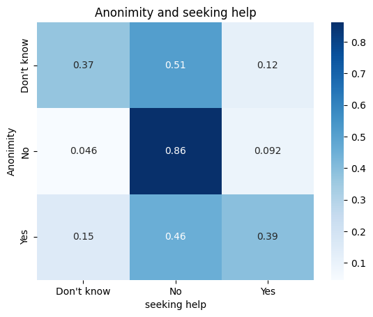

# EDA-on-Mental-Health-Survey
## Description
A Data Analysis Project on Mental Health Survey. Goals achieved in this project:
1. Cleaned the data (Sorting values, filling null rows)
2. Found relations between columns 
3. Plotting and visualizing for better understanding

## Outputs

